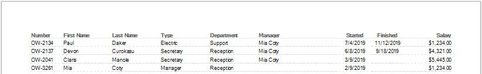

I often use [DevExpress Reports](https://www.devexpress.com/subscriptions/reporting/) in software projects. This library is good enough for faster developing. But in large projects, in which there may be many similar reports, development may be inconvenient. The problem is in [Visual Studio Report Designer](https://docs.devexpress.com/XtraReports/4256/visual-studio-report-designer). Designer from DevExpress is good for developing the several reports, but not convenient for developing the hundred reports with similar template and behaviour.

That's why I created extensions, that make report development with the DevExpress library easier and more intuitive. Instead of using the Report Designer, developer can generate the reports directly in C# code.

#### How does it work?

The simplest example demonstrates the main approach:

 ```csharp
var report = new DevExpress.XtraReports.UI.XtraReport();

report
  .AddGrid()
    .AddColumn(1D, "Number", nameof(Person.Number))
    .AddColumn(1.5D, "First Name", nameof(Person.FirstName))
    .AddColumn(1.5D, "Last Name", nameof(Person.LastName))
    .AddColumn(1.5D, "Type", nameof(Person.Type))
    .AddColumn(1.5D, "Department", nameof(Person.Department))
    .AddColumn(2.5D, "Manager", nameof(Person.Manager))
    .AddColumnDate(1D, "Started", nameof(Person.EmploymentDate))
    .AddColumnDate(1D, "Finished", nameof(Person.DismissalDate))
    .AddColumnMoney(1.5D, "Salary", nameof(Person.Salary));

report.DataSource = new List<Person>() { 
  new Person { Number = "OW-2134", FirstName = "Paul", LastName = "Daker", ... },
  new Person { Number = "OW-2137", FirstName = "Devon", ... } 
  ... 
};
```

The result looks like:


#### What else is inside?

DevExpress Report Extensions contain features, that allows to create headers and footers, groups and additional calculations for summaries, grids and column headers, page numbering and nested Master-Detail reports. These extensions can be easily expanded with different styles and design templates.

#### Support or Contact

Please, read the [Wiki](../../wiki) pages for detail information.

Having questions? [Contact me](https://github.com/CanadianBeaver) and I will help you sort it out.
